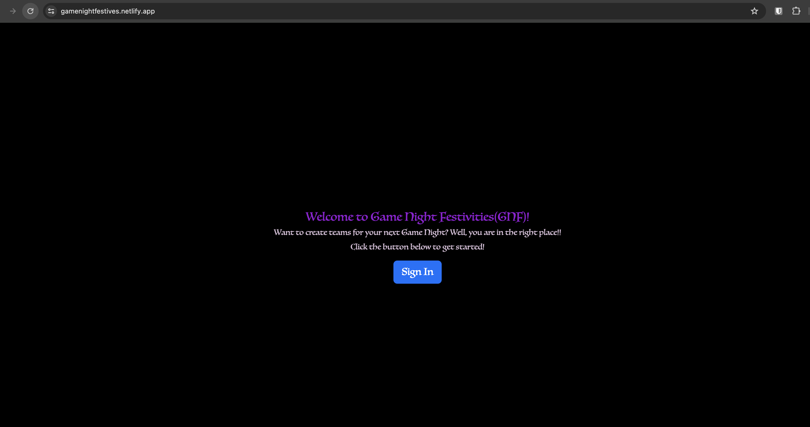
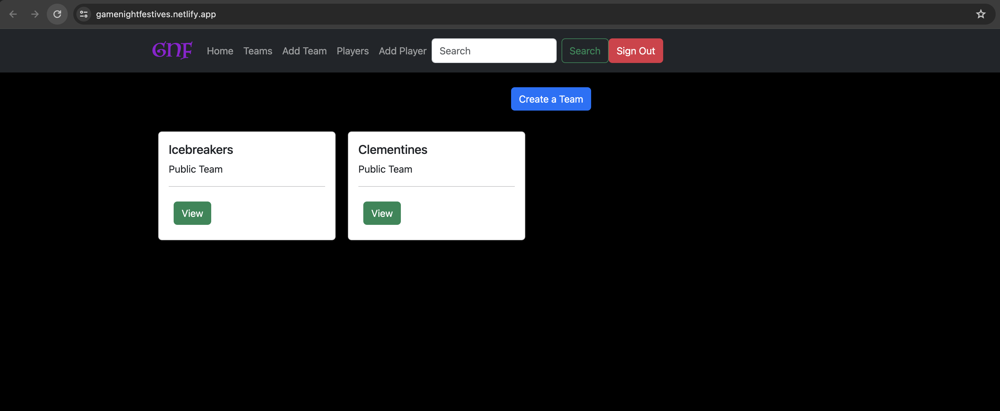

# GNF - Game Night Festivities 

[Click Here to Access App](https://gamenightfestives.netlify.app/)

## App Overview
GNF short for Game Night Festivities, is an application that allows an user to create teams and players for created teams ahead of a game night with friends once signed in.

## App Features
- User is able to login via google
- User is able to see teams that are public to them (if any) and able to create a team from that view
- User is not able to edit or delete public teams but can view players of public team
- User can navigate to home view (which show sthe teams), teams, players, add a team, or add a player from the Navigation Bar.
- The logo or initials in the Naviagation take you back to he Home view.
- User can search for players in the Navigation bar. (If user does not exist, a message will appear that says "No results are found for {typed name})
- User can create a team and make it private or public.
- User can view, edit, and delete their created team/s or player/s.
- When creating a player, a user has the option of making the player's role a player or a judge.
- When creating a player, you can assign them immediately to a team if one is created (No team created, the Team option will empty when player is created)

## Video Walkthrough of GNF
TBA - To Be Added

## Additional View of GNF 

## Relevant Links 
- [ERD](https://dbdiagram.io/d/Team-Roster-65a7372dac844320ae124ff0)

## Contributors
- [Britnay Gore](https://github.com/britnay268)
